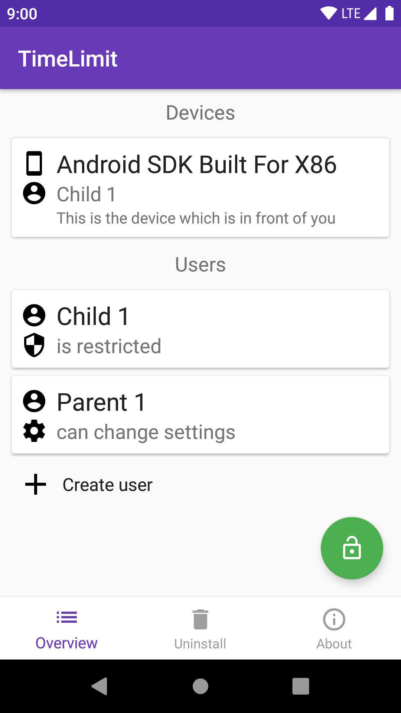
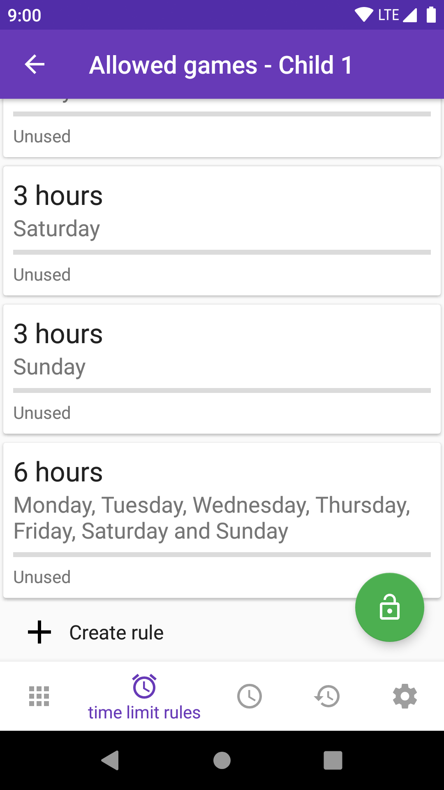

# Open TimeLimit

This App allows setting time limits for the usage of Android phones/ devices.

It is a fork of the App [TimeLimit](https://timelimit.io)
with all networking related features removed.

[](https://f-droid.org/app/io.timelimit.android.open)

### Building

Open it with Android Studio and press the Run button.

### Screenshots





### Enabling the device owner permission

```adb shell dpm set-device-owner io.timelimit.android.open/io.timelimit.android.integration.platform.android.AdminReceiver```
